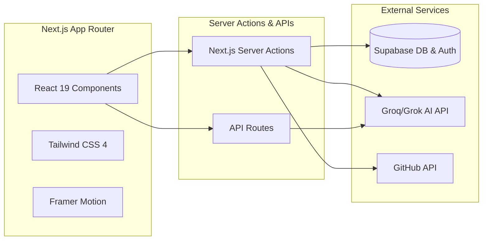
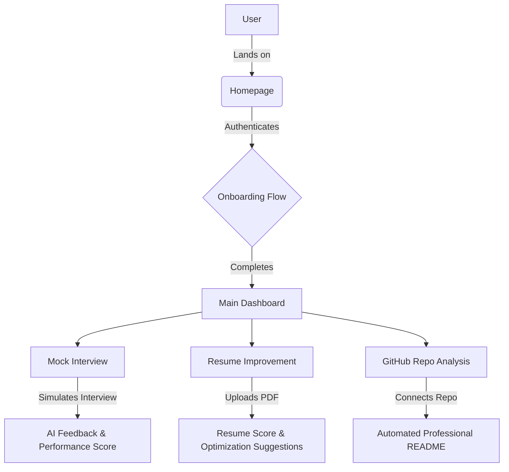

<h1 align="center"> SkillBridge </h1>
<p align="center"> Architecting the Future of Professional Documentation and Career Readiness through Generative Intelligence. </p>

<p align="center">
  
  
  
  
  
</p>

## 📑 Table of Contents
- [🔭 Overview](#-overview)
- [🧩 Architecture & Flow](#-architecture--flow)
- [✨ Key Features](#-key-features)
- [🛠️ Tech Stack](#️-tech-stack)
- [📁 Project Structure](#-project-structure)
- [🚀 Getting Started](#-getting-started)
- [🔧 Usage](#-usage)
- [🤝 Contributing](#-contributing)
- [📝 License](#-license)

---

## 🔭 Overview

**SkillBridge** is a comprehensive professional documentation and career optimization platform designed to bridge the gap between complex codebases and high-impact repository presentation. By leveraging advanced generative AI, SkillBridge transforms the often-tedious task of repository analysis and README generation into a seamless, automated experience that empowers developers to showcase their work with the professional polish it deserves.

### The Problem
> Modern software development moves at a lightning pace, yet documentation remains a persistent bottleneck. Developers frequently struggle to articulate the value of their technical achievements, leading to repositories that are technically brilliant but poorly communicated. This "documentation debt" results in lower project adoption, confusion for contributors, and missed opportunities for developers to truly demonstrate their expertise to potential employers or collaborators.

### The Solution
SkillBridge provides a centralized suite for technical professionalization. It eliminates the friction of manual documentation by providing an intelligent interface that analyzes repository structures and generates comprehensive README files. Beyond mere documentation, it extends its utility into career readiness through integrated resume analysis and mock interview preparation.

---

## 🧩 Architecture & Flow

### System Architecture
SkillBridge is built on a modern **Component-based Architecture** utilizing **Next.js 16** with the App Router. The backend logic is encapsulated within Next.js Server Actions, providing a secure and efficient bridge to external AI models and database services.



### User Journey Flow
The platform is designed to seamlessly guide users from onboarding to actionable career insights.



---

## ✨ Key Features

SkillBridge is designed with a user-centric philosophy, focusing on delivering tangible outcomes for developers at every stage of their project lifecycle.

### 🚀 Automated Repository Documentation
Transform your GitHub repositories into professional showcases. By analyzing the structure and content of your code, SkillBridge generates structured README files.
- **Benefit:** Save hours of manual writing while ensuring your project meets industry standards.
- **User Action:** Simply connect your repository and let the AI extract the essential technical context.

### 📄 Intelligent Resume Optimization
The platform identifies gaps in technical descriptions and suggests high-impact enhancements.
- **Benefit:** Increases the visibility of your technical skills to screening systems and recruiters.
- **User Action:** Upload a PDF resume and receive immediate, actionable feedback.

### 🎙️ Interactive Mock Interviews
Prepare for high-stakes technical evaluations using the `mock-interview` environment. Simulate real-world interview scenarios.
- **Benefit:** Reduces interview anxiety and improves technical articulation.

### 📊 Progress Tracking & Dashboarding
The centralized dashboard provides a holistic view of your career readiness and project documentation status.
- **Benefit:** Gamified yet professional approach to career growth.

### 🎨 Stunning Visual Interface
Leveraging high-end UI components such as `AnimatedBeam`, `Marquee`, and the `Sora` typography configuration, SkillBridge offers a premium aesthetic.

---

## 🛠️ Tech Stack

SkillBridge is built using a curated selection of cutting-edge technologies.

| Technology | Purpose | Why it was Chosen |
| :--- | :--- | :--- |
| **Next.js 16** | Full-stack Framework | App Router architecture, SSR, and Server Actions. |
| **React 19** | UI Library | Concurrent rendering and modern hook improvements. |
| **TypeScript** | Type Safety | Codebase maintainability and strict typing. |
| **Tailwind CSS 4** | Styling | Utility-first approach with optimized CSS processing. |
| **Supabase** | Auth & Database | Scalable Backend-as-a-Service with SSR support. |
| **Framer Motion** | Animation | Sophisticated, declarative UI animations. |
| **Groq/Grok SDK** | AI Integration | High-speed inference for real-time analysis. |

---

## 📁 Project Structure

```text
SkillBridge/
├── app/                         # Core application logic and routing
│   ├── actions/                 # Next.js Server Actions 
│   ├── api/                     # Backend API route definitions
│   ├── dashboard/               # Main user overview interface
│   ├── mock-interview/          # Interview simulation environment
│   ├── onboard/                 # New user welcome and setup flow
│   ├── resume-improve/          # Resume enhancement workspace
│   └── page.tsx                 # Landing page
├── components/                  # Reusable UI building blocks
│   └── ui/                      # Primitive and custom UI components
├── lib/                         # Shared utilities and service clients
│   └── supabase/                # Database and Auth clients
└── public/                      # Static assets
```

---

## 🚀 Getting Started

### Prerequisites
* **Node.js**: Ensure you have the latest LTS version installed.
* **Package Manager**: npm or pnpm.

### Installation

1. **Clone the repository:**
   ```bash
   git clone https://github.com/gauravag18/SkillBridge.git
   cd SkillBridge
   ```

2. **Install dependencies:**
   ```bash
   npm install
   ```

3. **Set up Environment Variables:**
   Create a `.env.local` file in the root and add your Supabase, GitHub, and AI API keys.

4. **Initialize development server:**
   ```bash
   npm run dev
   ```

5. **Build for production:**
   ```bash
   npm run build
   ```

---

## 🔧 Usage

Once the development server is running, navigate to `http://localhost:3000`.

### 1. Documenting a Repository
- Navigate to the **GitHub Integration** section.
- Provide repository details. Let the AI scan and generate your README.

### 2. Improving Your Resume
- Head to the `/resume-improve` page.
- Upload your PDF to calculate your score and receive optimization tips.

### 3. Mock Interview Practice
- Enter the `/mock-interview` module.
- Select your target role and begin the AI-driven interview simulation.

---

## 🤝 Contributing

We welcome contributions to improve SkillBridge!

1. **Fork the repository**
2. **Create a feature branch:** `git checkout -b feature/amazing-feature`
3. **Commit your changes:** `git commit -m 'Add amazing feature'`
4. **Push to the branch:** `git push origin feature/amazing-feature`
5. **Open a Pull Request**

### Development Guidelines
- ✅ Follow existing code styles (TypeScript/Tailwind).
- 📝 Add comments for complex logic.
- 🎯 Keep commits focused and atomic.

---

## 📝 License

This project is licensed under the **MIT License** - see the [LICENSE](LICENSE) file for complete details.
